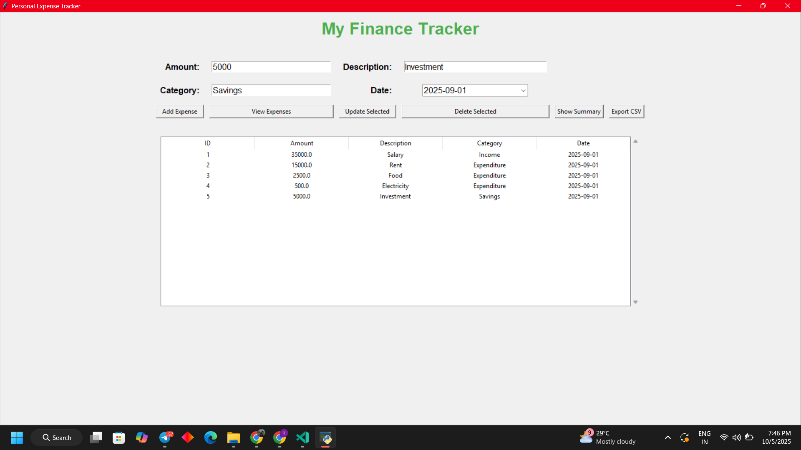
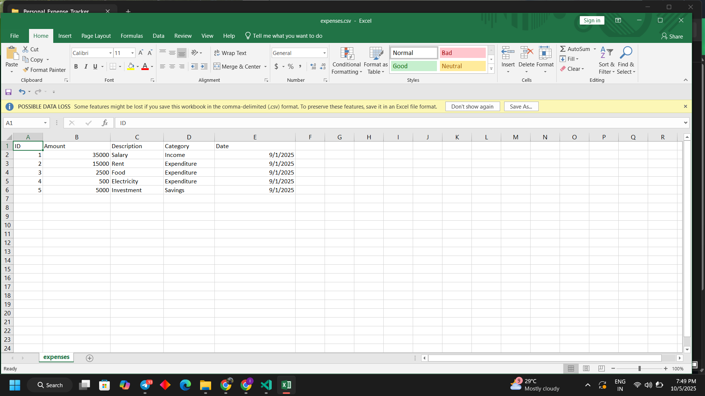
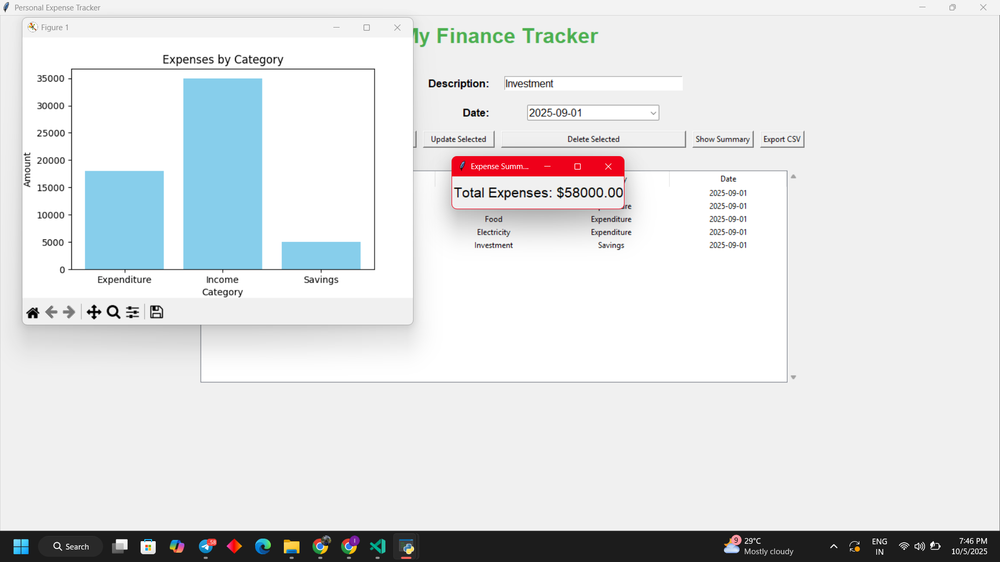

# 💰 My Finance Tracker Assistant

**My Finance Tracker Assistant** is a fun and intuitive Python desktop app designed to help you take control of your personal finances! 🏦 Track your income and expenses, visualize trends with interactive charts 📊, generate detailed summary reports, and keep your data safe with easy exports 🗃️. Perfect for budgeting, planning, and achieving your financial goals! 💡
---

##🚀 Features

- 📝 **Add Expenses** – Record amount, description, category (Income/Expenditure), and date.  
- 🔄 **Update & Delete** – Modify or remove existing records.  
- 📊 **Summary Reports** – Total spent, grouped by category and month, with bar/line charts.  
- 🗃️ **Export CSV** – Save your financial data for backup or analysis.  
- 📈 **Visual Charts** – Interactive plots for spending patterns.  
- 🔁 **Toggle Expense Table** – Show or hide the transaction table for a clean interface.  

---

##🛠️ Installation

1. Clone this repository:  
```bash
git clone https://github.com/your-username/finance-tracker.git
````

2. Install dependencies:

```bash
pip install tk matplotlib tkcalendar
```

3. Run the app:

```bash
python main.py
```

---

##🖱️ Usage

1. Enter **Amount**, **Description**, **Category** (Income or Expenditure), and **Date**.
2. Click **Add Expense** to save.
3. Use **View Expenses** to toggle the transaction table.
4. Click **Show Summary** to view charts and total spending.
5. Export your data via **Export CSV** for backups.
6. Update or delete entries by selecting them from the table.

---

##🖼️ Screenshots





---

##💻 Tech Stack

* **Python 3.x**
* **Tkinter** – GUI
* **SQLite** – Database
* **Matplotlib** – Charts
* **Tkcalendar** – Date Picker

---

## Contributing

Contributions are welcome! Submit issues or pull requests.

## License

MIT License


